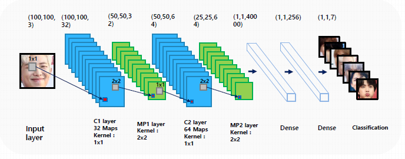
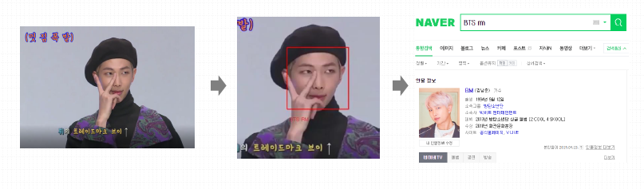

# NUGUDEORA

혁신성장 청년인재 이미지 분석 3번째 프로젝트: 연예인 얼굴 인식


### 1. 팀원

---

김채윤 김현하 송윤성 이주환 이대광 장희은


### 2. 사용 기술

---

#### 1) 데이터 수집

- `GoogleImageCrawler` 사용: 원하는 개수만큼 데이터 수집 가능

- `FaceROI`: 사진에서 얼굴만 추출

- 코드: [Image_Crawling.ipynb](./learning.ipynb)

  

#### 2) 데이터 전처리

> 참고: https://github.com/aleju/imgaug

- 다양한 filter를 사용해 하나의 사진을 10개로 부풀림

- `Anaconda Prompt`를 통해 필요한 패키지 설치

  ```
  conda config --add channels conda-forge
  conda install imgaug
  ```

- `pip`을 통해 필요한 `imgaug` 패키지 설치

  ```
  pip install imgaug
  ```

- 코드: [Data Augmentation.ipynb](./Data Augmentation.ipynb)


#### 3) 모델 생성

- `Sequential 모델` 사용

  

- 코드: [learning.ipynb](./learning.ipynb)


#### 4) 모델 적용

- 학습된 모델을 불러온 후 영상에 적용
- 영상에서 궁금한 연예인이 나온 순간 `Enter`키를 통해 naver에 검색

- 코드: [Video Capturing.ipynb](./Video Capturing.ipynb)

  

### 3. 결과

---

  